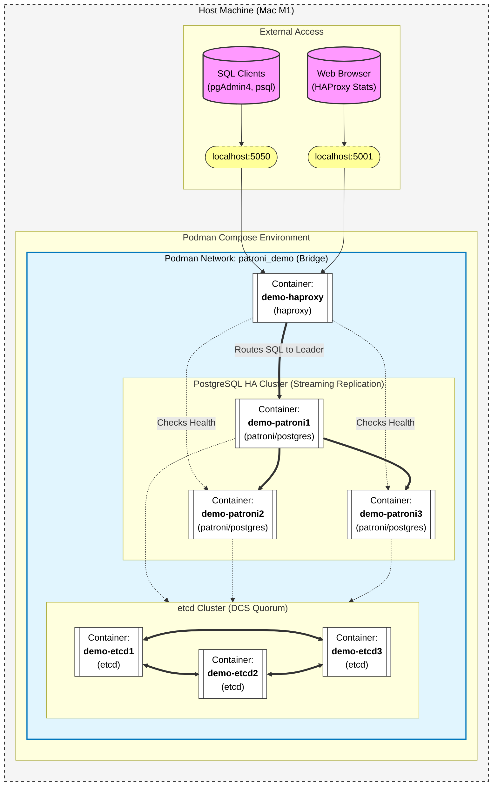

### High Availability and Disaster Recovery

A reliable PostgreSQL architecture must survive both the failure of a single node and the accidental deletion of data by a user.
HA Stacks: Patroni, Etcd, and HAProxy

High Availability in PostgreSQL is achieved by combining several specialized tools into a cohesive "stack." The industry standard for automated failover is Patroni.

Patroni: A Python-based cluster manager that runs on each database node. It manages the PostgreSQL process and interacts with a Distributed Configuration Store (DCS).

Etcd: The DCS that serves as the "source of truth." It maintains a leader key with a Time-to-Live (TTL). The Patroni node holding the leader key is the primary.

HAProxy: A load balancer that routes application traffic. It uses health checks against the Patroni REST API to determine which node is currently the primary (endpoint /primary) and which are replicas (endpoint /replica).

### Laboratory: Simulating Automated Failover
In this lab, we use a Podman or Docker Compose environment to observe how Patroni handles the sudden loss of the primary node.

```
git clone https://github.com/patroni/patroni
cd patroni
```

```
podman build -t patroni .
```

### Podman compose to setup the Patroni Clusterd Postgres
```
podman compose up -d
```



### 1. Check current cluster status

```
podman exec -it  demo-patroni1 patronictl list
```

##### Samaple output for reference
```
avannala@Q2HWTCX6H4 patroni % podman exec -it  demo-patroni1 patronictl list
+ Cluster: demo (7648343233083748380) --------+----+-------------+-----+------------+-----+
| Member   | Host       | Role    | State     | TL | Receive LSN | Lag | Replay LSN | Lag |
+----------+------------+---------+-----------+----+-------------+-----+------------+-----+
| patroni1 | 10.89.1.14 | Leader  | running   |  1 |             |     |            |     |
| patroni2 | 10.89.1.15 | Replica | streaming |  1 |   0/404F9F0 |   0 |  0/404F9F0 |   0 |
| patroni3 | 10.89.1.11 | Replica | streaming |  1 |   0/404F9F0 |   0 |  0/404F9F0 |   0 |
+----------+------------+---------+-----------+----+-------------+-----+------------+-----+
```

### 2. Create an admin Role to login via PgAdmin 

NOTE: Leader node should use to run when running create/write commands

```
podman exec -it  demo-patroni1 psql -d postgres -c "CREATE ROLE admin WITH LOGIN SUPERUSER PASSWORD 'password';"
```

### 3 Lets load some sample data

```
podman exec -it  demo-patroni1 psql -d postgres 
```

### 4. Lets connect via PgAdmin to see how seamless you can access the data.

- Register Server : patroni-cuslter
- Connection Details: 
  - localhost
  - postgres
  - 5050 or 5001 (we will use the ha-proxy ports versus the postgres default port)
  - admin
  - password

 
### 5. Simulate failure by stopping the leader

```
podman stop  demo-patroni1
```

### 6. Check the status

NOTE: Use the other running nodes to run the command in this case we use "demo-patroni2" node
 
```
podman exec -it  demo-patroni2 patronictl list
```

##### Sample output
```
avannala@Q2HWTCX6H4 patroni % podman exec -it  demo-patroni2 patronictl list
+ Cluster: demo (7648343233083748380) --------+----+-------------+-----+------------+-----+
| Member   | Host       | Role    | State     | TL | Receive LSN | Lag | Replay LSN | Lag |
+----------+------------+---------+-----------+----+-------------+-----+------------+-----+
| patroni2 | 10.89.1.15 | Replica | streaming |  2 |  0/D5A245D8 |   0 | 0/D5A245D8 |   0 |
| patroni3 | 10.89.1.11 | Leader  | running   |  2 |             |     |            |     |
+----------+------------+---------+-----------+----+-------------+-----+------------+-----+
```

### 7. Observe Patroni electing a new leader and HAProxy updating its route

```
 podman logs demo-haproxy -f
```

### 8. Run some queries via PgAdmin to validate you are still able to access data or write data etc

```
SELECT account_id, user_id, currency, balance, account_type, updated_at
	FROM public.accounts limit 10;
```

### 10. Validate node status via psql 

```
podman exec -it demo-haproxy psql -h 127.0.0.1 -p 5000 -U admin  -d postgres
```

Password for user admin: password

```
psql (17.10 (Debian 17.10-1.pgdg13+1))
Type "help" for help.

postgres=# SELECT pg_is_in_recovery();
 pg_is_in_recovery
-------------------
 f
(1 row)

postgres=#
```

```
podman exec -it demo-patroni2 psql -U postgres -d postgres -c "SELECT pg_is_in_recovery();"
```
##### Interpretation:

- f (false): You are connected to the Primary/Leader node. Proceed with the queries below.

- t (true): You are connected to a Standby/Replica node. (Replication views pg_stat_replication and pg_replication_slots will likely be empty on this node). Connect to HAProxy (port 5050) instead.

### 10. psql queries 

````
 podman exec -it demo-patroni2 psql -U postgres -d postgres -c "
SELECT
    application_name AS replica_name,
    client_addr AS ip_address,
    state,
    sync_state
FROM
    pg_stat_replication;
"
```


```
podman exec -it demo-patroni2 psql -U postgres -d postgres -c "
SELECT
    pg_last_wal_receive_lsn() AS last_received,
    pg_last_wal_replay_lsn() AS last_replayed,
    -- Calculate how much data is received but not yet replayed locally
    pg_size_pretty(pg_wal_lsn_diff(pg_last_wal_receive_lsn(), pg_last_wal_replay_lsn())) AS pending_replay_bytes;
"
```


```
podman exec -it demo-patroni2 psql -U postgres -d postgres -c "
SELECT
    slot_name,
    plugin,
    slot_type,
    active, -- Is a replica currently using this slot?
    restart_lsn,
    -- Calculate how much WAL data this slot is holding back from being deleted (Postgres 13+)
    pg_size_pretty(pg_wal_lsn_diff(pg_current_wal_lsn(), restart_lsn)) AS wal_kept_by_slot
FROM
    pg_replication_slots;"
```


```
podman exec -it demo-patroni2 psql -U postgres -d postgres -c "
SELECT
    application_name AS replica_name,
    client_addr AS ip_address,
    state,
    sync_state,
    -- The time lag between write on primary and write on replica
    write_lag,
    -- The time lag between write on primary and flush on replica
    flush_lag,
    -- The time lag between write on primary and replay on replica (Actual read consistency lag)
    replay_lag
FROM
    pg_stat_replication;"
```


```
podman exec -it demo-patroni2 psql -U postgres -d postgres -c "
SELECT
    usename AS user_name,
    application_name AS replica_name,
    client_addr AS ip_address,
    state,
    sync_state,
    pg_current_wal_lsn() AS primary_lsn,
    sent_lsn,
    write_lsn,
    flush_lsn,
    replay_lsn,
    -- Calculate lag in bytes (Modern PG 10+)
    pg_wal_lsn_diff(pg_current_wal_lsn(), replay_lsn) AS total_lag_bytes,
    -- Pretty print lag (e.g., 5 MB, 10 GB)
    pg_size_pretty(pg_wal_lsn_diff(pg_current_wal_lsn(), replay_lsn)) AS pretty_total_lag
FROM
    pg_stat_replication;"
```


The system should complete the failover in under 30 seconds, ensuring minimal downtime for the application. The use of a DCS like Etcd prevents "Split-Brain" scenarios, where two nodes both believe they are the primary, which would lead to catastrophic data divergence.


### What you are observing:
Within seconds, Patroni on pg-node2 realizes the TTL on the Etcd leader key has expired because pg-node1 is no longer updating it. pg-node2 immediately promotes itself to Leader!

The system completes this failover in under 30 seconds, ensuring minimal downtime for an application. Because Patroni relies on Etcd as the single source of truth, it completely prevents "Split-Brain" scenarios—meaning even if pg-node1 suddenly wakes back up, it will realize it lost the lock and demote itself to a replica, saving you from catastrophic data divergence.